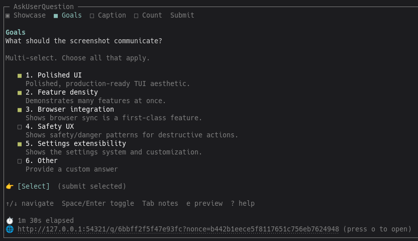
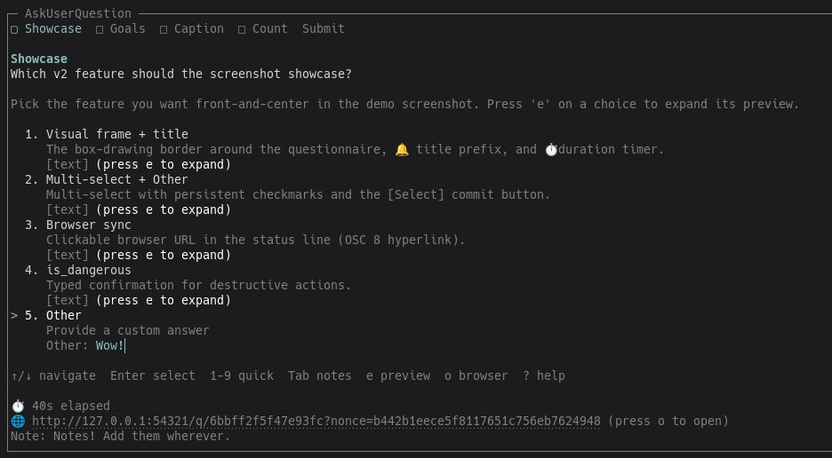

# pi-questionnaire

Claude Code-compatible `AskUserQuestion` tool for the [pi](https://github.com/earendil-works/pi-mono) coding agent.

Replaces v1's `ask_user` with the same shape Claude Code uses — five question types, per-question notes, persistent checkmarks, rich previews, a typed-confirmation "danger" flow for destructive actions, and per-setting side effects (BEL, desktop notification, TTS, custom command, idle heartbeat, browser-intent log, herdr blocked-status) wired through a 14-field settings module.

## Screenshots


*Caption for screenshot 1*


*Caption for screenshot 2*

## What it is

A single tool, registered as `AskUserQuestion`, that:

- Asks 1–4 questions per call.
- Returns a canonical, stringified-indexed answer map: `{ "0": {...}, "1": [...] }`.
- Supports `select_one`, `select_many`, `confirm_enum`, `number`, `free_text`.
- Auto-appends a synthetic **Other** option to every choice-based question so the user is never trapped.
- Lets the user attach **notes** per question (independent of the answer).
- Plays a terminal **bell** and prefixes the terminal **title** with 🔔 on mount.
- Runs a live **duration timer** in the status line while the questionnaire is on screen.
- Honors a per-question `is_dangerous` flag, gated by the `dangerCheckEnabled` setting, that forces the user to type an explicit confirmation before a destructive action is accepted.

## Install

```bash
# from the pi-questionnaire repo
pi install .
```

This symlinks `src/index.ts` into your global `~/.pi/agent/extensions/` and installs dependencies via pnpm. Restart pi (or `/reload`) to pick up the extension.

### Manual install

```bash
pnpm install
# then add to ~/.pi/agent/settings.json → extensions:
#   /absolute/path/to/pi-questionnaire/src/index.ts
```

## Quick start

Ask the LLM to use the `AskUserQuestion` tool. For example:

> "Use AskUserQuestion to ask me which environment to deploy to, with options staging, production, or canary. Then deploy to whichever I pick."

The model will call:

```json
{
  "questions": [{
    "header": "Env",
    "question": "Which environment should we deploy to?",
    "type": "select_one",
    "options": [
      { "label": "staging",  "description": "Validate safely" },
      { "label": "production", "description": "Ship it" },
      { "label": "canary",   "description": "1% of traffic" }
    ]
  }]
}
```

The user picks from the TUI and the model receives a canonical answer map.

## Required fields

Every question must include `header`, `question`, and `type`. Choice questions (`select_one`, `select_many`, `confirm_enum`) must also include `options` — except `confirm_enum`, which auto-fills `[{Affirm},{Decline}]` when `options` is omitted.

## The 5 question types

| Type            | UI                                              | Output value                                       | Notes                                       |
|-----------------|-------------------------------------------------|----------------------------------------------------|---------------------------------------------|
| `select_one`    | list, ↑↓ + Enter                                | `{mode:"option",value}` or `{mode:"other",text}`   | up to 7 user options + auto `Other` = 8     |
| `select_many`   | checkbox list + `[Select]` button               | `[{mode:"option",value} \| {mode:"other",text},…]` | Space to toggle, Enter on `[Select]` commits |
| `confirm_enum`  | list (Affirm / Decline / Other)                 | `{mode:"option",value:"affirm"\|"decline"}` or `other` | Default options if `options` omitted       |
| `number`        | editor + ↑/↓ nudge                              | `number`                                           | honors `min` / `max`                        |
| `free_text`     | multiline editor (always)                       | `string`                                           | `multiline` defaults to `true`              |

## The auto-appended "Other" option

Every choice-based question gets a synthetic **Other** option that opens a free-text editor. User-provided options are capped at **7**, so the post-Other total is **8 max**. The Other option is never counted against user uniqueness checks, and is case-insensitive on label match (so `other`, `Other`, `OTHER` all collapse to the same slot).

## `is_dangerous` flag

Mark a question as destructive:

```json
{
  "header": "Wipe DB",
  "question": "Drop the prod database?",
  "type": "confirm_enum",
  "is_dangerous": true
}
```

The TUI then renders a `⚠️  DESTRUCTIVE` header and forces the user to type a confirmation string before the answer is accepted. Esc cancels the whole questionnaire (no partial commit). The behavior is gated by the `dangerCheckEnabled` setting so trusted environments can disable it. See [docs/USAGE.md](docs/USAGE.md#is_dangerous-confirmation) for the full flow.

## Notes per question

Press `Tab` (or `n`) on a question to swap to a notes editor. Notes are independent of the answer, so you can annotate an answered question, a multi-select, or a danger flow. On submit, notes flow back to the model under the same `notes` key in the tool result.

## Settings (14 fields, grouped)

Configured via `<agentDir>/ask-user-question.json` (global) and/or `<cwd>/.pi/ask-user-question.json` (project). Project overrides global. Defaults from `src/settings.ts`:

| Group        | Field                       | Default | What it does                                         |
|--------------|-----------------------------|---------|------------------------------------------------------|
| **Browser**  | `browserEnabled`            | `true`  | Start the HTTP server alongside the TUI *(slice 5+)* |
|              | `browserAutoOpen`           | `false` | Auto-open the browser when ≥ `browserMinQuestions`   |
|              | `browserMinQuestions`       | `2`     | Threshold for auto-open (1–4)                        |
|              | `copyUrlToClipboard`        | `true`  | Copy the URL to the clipboard when generated         |
| **Audio/UX** | `bellOnQuestion`            | `true`  | Audible BEL on mount                                 |
|              | `notificationOnQuestion`    | `false` | Desktop notification on mount                        |
|              | `notificationDelaySeconds`  | `30`    | Delay before notification fires (0–300)              |
|              | `ttsOnQuestion`             | `false` | Speak the header via `attn` on mount                 |
|              | `onQuestionCommand`         | `""`    | Shell command to run on mount (gets payload via env) |
| **Heartbeat**| `heartbeatWhileActive`      | `false` | Send a keepalive heartbeat while the TUI is on screen |
|              | `heartbeatIntervalMinutes`  | `4.5`   | Idle interval in minutes (0.5–60)                    |
| **Input**    | `debounceMs`                | `300`   | Debounce (ms) when typing into number/free_text      |
| **Safety**   | `dangerCheckEnabled`        | `true`  | Enforce the `is_dangerous` typed-confirmation flow   |
| **Integrations** | `herdrReportBlocked`    | `true`  | Mark the herdr pane `blocked` while a question is on screen (no-op outside herdr) |

Full reference (types, ranges, behavior): [docs/USAGE.md#settings-reference](docs/USAGE.md#settings-reference).

The settings menu is available via the menu command in pi (slash name will land with the menu UI in a separate slice — see `docs/USAGE.md` for now). Until then, hand-edit the JSON files.

## Herdr integration

[Herdr](https://herdr.dev) is a terminal agent multiplexer that shows each pane's semantic state — `working`, `blocked`, `done`, `idle` — in a sidebar so you can see which agent needs attention. While an `AskUserQuestion`/`ask_user` TUI is on screen the agent is **blocked waiting on a human**, so pi-questionnaire tells herdr exactly that.

When `herdrReportBlocked` is on (the default) and the process is inside a herdr-managed pane (`HERDR_ENV=1` + `HERDR_PANE_ID`), the extension runs, on mount:

```bash
herdr pane report-agent "$HERDR_PANE_ID" \
  --source user:pi-questionnaire --agent pi --state blocked \
  --custom-status "answering question" --message "AskUserQuestion: <header>"
```

and, when the questionnaire is answered / cancelled / thrown:

```bash
herdr pane release-agent "$HERDR_PANE_ID" --source user:pi-questionnaire --agent pi
```

The release restores the pane's prior status authority. Reports are fire-and-forget and never break the tool; outside herdr the whole feature is a no-op. This works whether or not you have the official `herdr integration install pi` lifecycle extension installed — pi-questionnaire's report is the most authoritative source for "a question is on screen right now."

Verify from another pane with `herdr agent list` (look for `agent_status: "blocked"` + `custom_status: "answering question"`) or `herdr wait agent-status <pane> --status blocked`.

## Keymap

| Key            | Action                                                       |
|----------------|--------------------------------------------------------------|
| `↑` / `↓`      | Navigate options; nudge value on `number`                    |
| `Enter`        | Select / commit / submit                                     |
| `Space`        | Toggle option (`select_many`)                                |
| `Tab` / `n`    | Swap to notes editor (or back)                               |
| `1`–`9`        | Select option index (choice questions)                       |
| `Meta+1`–`Meta+4` | Jump to question N (multi-question). Meta = Alt / Option |
| `[` / `]`      | Previous / next question tab                                 |
| `0`            | Jump to Submit tab                                           |
| `e`            | Toggle preview expansion for current option                  |
| `o`            | Open browser URL *(slice 5+)*                                |
| `?`            | Help overlay (lists all shortcuts)                           |
| `Esc`          | Cancel (or back from notes)                                  |

## Migration from v1

The tool name changed (`ask_user` → `AskUserQuestion`), the schema changed (5 new types, no aliases, no `required`), and headless mode was removed. See the [v1 → v2 mapping table in docs/USAGE.md](docs/USAGE.md#migration-from-v1) for the full before/after.

## Architecture & usage

- [docs/ARCHITECTURE.md](docs/ARCHITECTURE.md) — module layout, data flow, TUI state machine, side effects wiring.
- [docs/USAGE.md](docs/USAGE.md) — full schema reference, per-type examples, previews, notes, settings reference, behavior flags.

## Development

### Tests

```bash
# Python unit/integration tests (schema, normalize, answers, side effects)
pnpm test:py

# Node tests (TUI render snapshots, settings module, helpers)
pnpm test

# Full e2e — currently a SKIP no-op; the real e2e lands with the browser path
bash tests/test_e2e_pi.sh

# All of the above
pnpm test:all
```

### Repo layout

```
src/
  index.ts          # extension entry; registers AskUserQuestion
  schema.ts         # typebox schema + semantic validation
  normalize.ts      # canonical v2 normalization (Other injection, confirm_enum defaults)
  types.ts          # canonical types + constants (MAX_*, label names)
  answers.ts        # answer payload coercion/validation
  tui.ts            # rich TUI (notes, checkmarks, danger flow, preview, help)
  settings.ts       # 14-field settings persistence (global + project merge)
  side-effects.ts   # on-question side effects (notification, TTS, command, heartbeat)
tests/
  harness.ts        # TS CLI that drives the pytest suite
  conftest.py       # pytest fixtures
  test_schema.py    # 26 cases
  test_normalize.py # 29 cases
  test_answers.py   # 25 cases
  test_side_effects.py # 31 cases
  test_tui_render.mjs # 50 cases
  test_e2e_pi.sh    # currently SKIP (full e2e lands with browser path)
docs/
  ARCHITECTURE.md
  USAGE.md
```

## License

MIT — see [LICENSE](LICENSE).